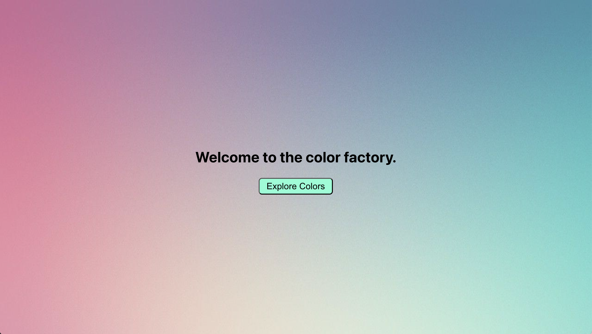
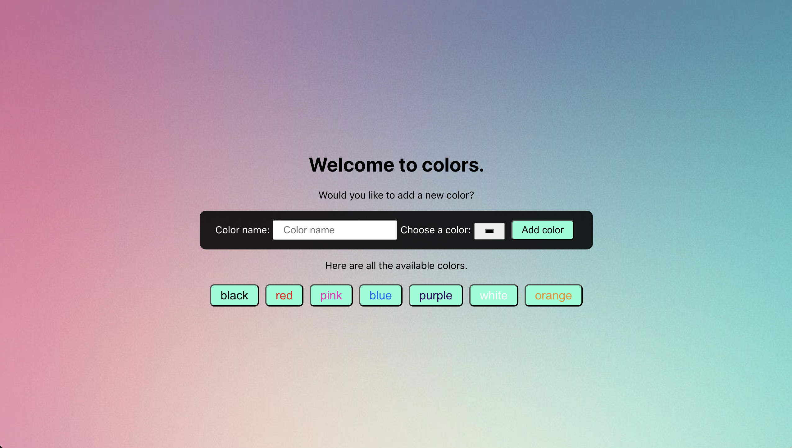
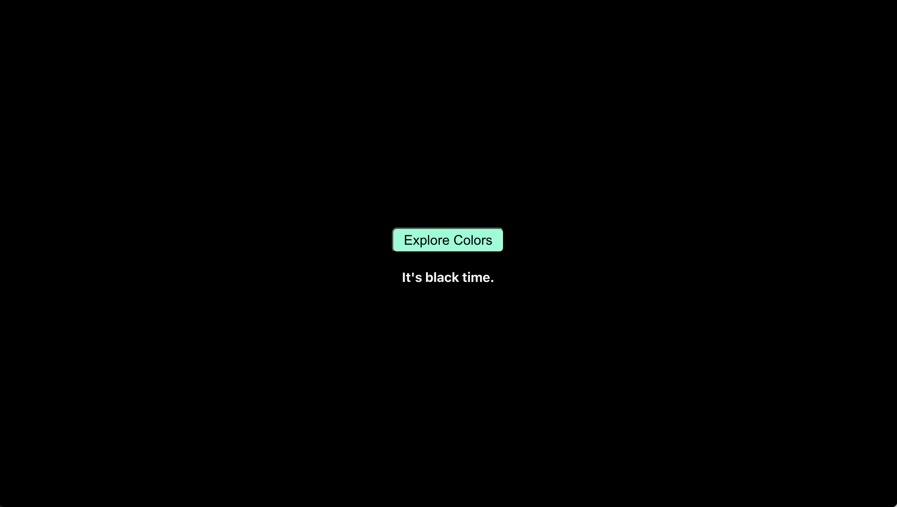

# Color Factory



Welcome to Color Factory, a simple React application where you can explore and add colors.

## Colors Preview



## Features

- View a list of available colors.
- Add a new color with a name and color picker.
- Click on a color to view its details.
- Responsive design for various screen sizes.

## Color Preview



## Installation

To run the application locally, follow these steps:

1. Clone the repository:

```bash
git clone https://github.com/your-username/color-factory.git
```

````

2. Navigate to the project directory:

```bash
cd color-factory
```

3. Install dependencies:

```bash
npm install
```

4. Start the development server:

```bash
npm start
```

5. Open your browser and visit `http://localhost:3000` to view the application.

## Technologies Used

- React: JavaScript library for building user interfaces.
- react-router-dom: Declarative routing for React applications.
- localStorage: Web storage API used to persist color data locally.
- CSS: Cascading Style Sheets for styling the application.
- JSX: Syntax extension for JavaScript used in React components.

## Folder Structure

```
color-factory/
├── public/
│   ├── index.html
│   └── ...
├── src/
│   ├── components
│   ├── App.css
│   ├── App.js
│   ├── InitialColors.js
│   └── index.js
├── package.json
└── README.md
```

## Credits

- Built by Samuel Abinsinguza

## License

This project is licensed under the [MIT License](LICENSE).


````
